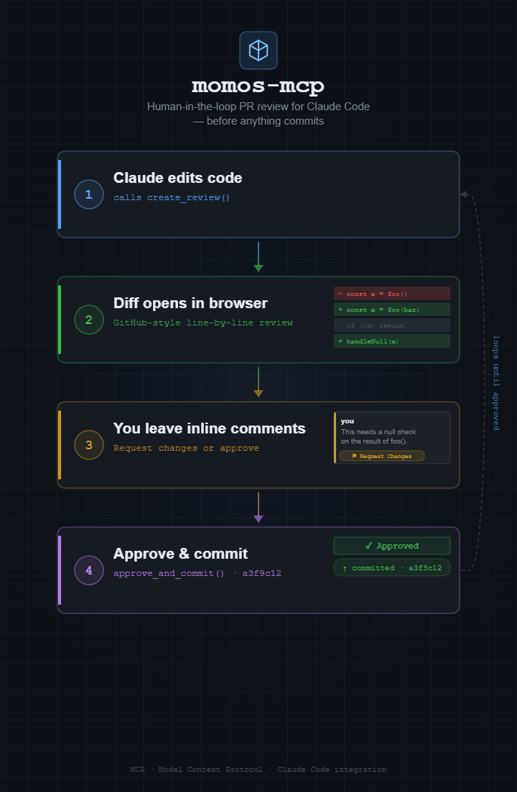

# momos-mcp



A local MCP server that brings an interactive, browser-based PR review loop to Claude Code.

Instead of committing blindly, Claude opens a GitHub-style diff UI in your browser after
making changes. You leave inline comments on specific lines, click "Request Changes" or
"Approve", and Claude responds — fixing each comment, marking it resolved, and looping
until you're satisfied. Only then does it commit.

## How it works

1. Claude makes code changes and calls `create_review()` → browser opens with the diff
2. You add inline comments on any line, then click **Request Changes** or **Approve**
3. If changes were requested, Claude fixes each comment, calls `mark_comment_resolved()`, and opens a fresh review
4. Once you click **Approve**, Claude calls `approve_and_commit()` and the commit is made

## Getting started

```bash
cd momos-mcp
bash setup.sh
```

Follow the printed instructions to register the MCP server with Claude Code, then add the
CLAUDE.md snippet below to any project where you want the review loop active.

## CLAUDE.md setup

Paste this into your project's `CLAUDE.md` (or your global `~/.claude/CLAUDE.md`):

~~~markdown
## PR Review with momos

All changes must happen on a short-lived branch — never commit directly to main.

### Branch discipline

Before writing any code, create a branch:

```
git checkout -b work/<short-name>
```

Use `work/` prefix and a short kebab-case name describing the change (e.g. `work/fix-auth`, `work/add-dark-mode`).

### Review loop (momos MCP server)

When the `momos` MCP server is available (verify with `/mcp`):

1. Make changes on the `work/` branch
2. Call `create_review()` — browser opens with the diff
3. Call `wait_for_approval()` and block until the user responds
4. If status is `"changes_requested"`: fix each comment, call `mark_comment_resolved(comment_id)` per fix, then loop back to step 2
5. Once status is `"approved"`: call `approve_and_commit(message)` — this commits and merges
6. Delete the work branch after merge

Never merge without going through the review loop.

### Fallback (momos not available)

If the MCP server is not connected:

1. Show a `git diff main...HEAD` summary
2. Discuss changes with the user
3. Merge and delete the branch only after explicit approval
~~~

